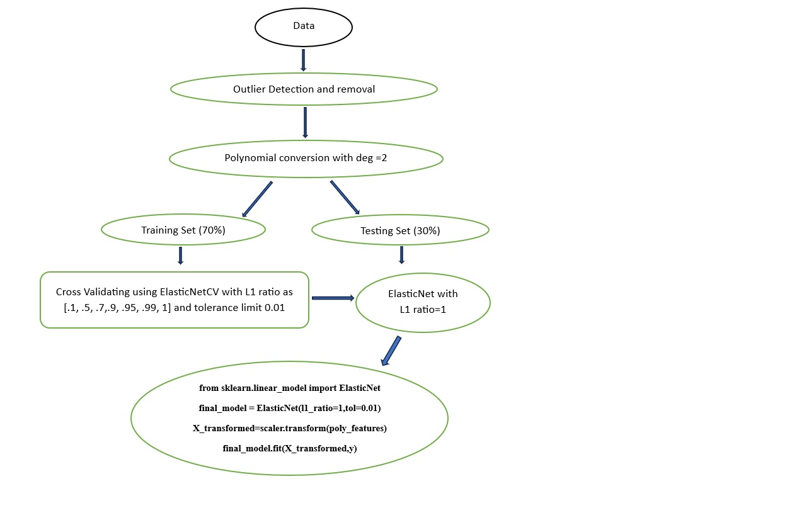
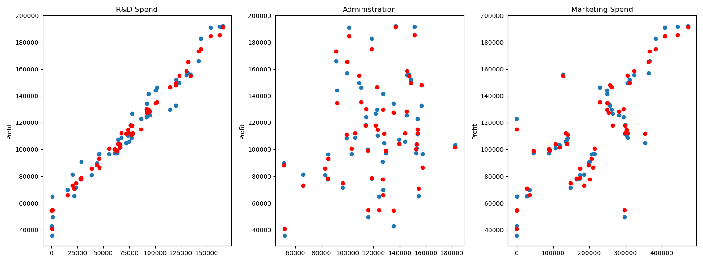
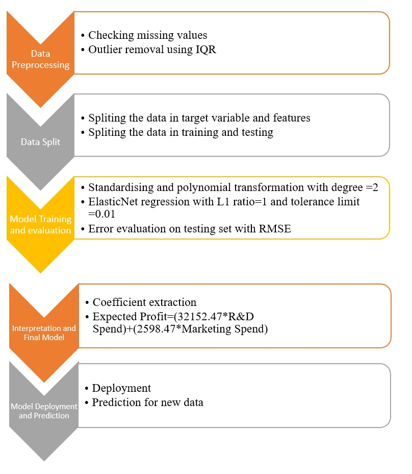

# REGRESSION ANALYSIS 

# Abstract

In today's world, every firm needs to appropriate its resources judiciously. In this project, I found a model which predicts the profit of a firm based upon their R & D Spend, Marketing Spend and Administration expenses.
For this, I use a dataset which contains the profit of 50 firms and their R & D Spend, Marketing Spend and administration spending. I have used different types of regressions like Linear Regression, Polynomial Regression, Lasso Regression, Ridge regression, Elastic net, KNearestNeighbors, support vector machines and tree-based regression to find a model. First, I check the outliers as they may affect the models because all models are distance based except tree-based regression, then split the data into training and testing sets with 30 % of the data in the testing set. Based on the root mean squared error, I found that ridge regression has the least error, but to make the model simple and interpretable, I used Elastic Net regression, which will be my final model. 
The significance of this project is to help firms to allocate their resources judiciously, better strategic planning, budgeting and investment decisions.

# Introduction

As we know, profit is the main goal for any firm, so it tries to maximize profit by judiciously utilizing its resources. The firms earn profit by creating value for their customers, which requires the right product for the right customer at the right time. Hence firms invest lots of resources toward Research and development, which need competent professionals and when a product develops, it requires a strong marketing campaign. Thus, R & D expenditure and marketing expense are correlated. So, to find how much investment in R&D, administration and marketing and what profit a firm can expect, we need a predictive model which can predict profit based on these expenses so that the firm can better appropriate its money towards them.
For this, I have collected a sample of 50 firms which contains profit based on R&D, Administration and marketing expenses. Based on this sample data, I created a predictive model that leverages the state of the art of machine learning.
In the early days, firms used statistics tools to predict profit using linear regression, which involved adding and dropping predictor variables from the model based on their predicting power. And this was time-consuming. And it assumes that the data follows a linearity pattern, so it fails to capture an accurate picture. In this project, I tried to find a model using different regression algorithms, as the features and target variables are continuous. And based on the error-to-mean ratio, I discovered that Elastic and Ridge's regression performs better than other regression algorithms. Still, I have chosen Elastic over the Ridge regression for better interpretability and tradeoff with error to mean ratio as the percentage increase in error to mean ratio is 4.22 %. Hence my proposed model is Elastic Net regression.

# Existing Method

In the existing method, we use the least square method to find the best-fit line for our regression algorithm. If the proper relation between the predictor and response variable is linear, then the least-square estimate has a low variance. If n>>p, that is, if n, the number of observations is much larger than the p, the predictor than the least square estimate has low variance and performs better on testing data. But the problem arises when the number of observations is small. The number of predictors than the least square estimate will have a more significant variance and perform poorly on testing data.
We use the Python statsmodel package to find a model based on the least square estimate, which provides every tool required for modelling. Then we use the subset selection method, which includes forward selection and backward elimination based on the p-value of F statistics. In forward-selection, we start with no predictor and add predictor variables based on F statistics and R square (a statistical measure representing the proportion of variance of the target variable explained by the predictor variables in the regression equation). And in backward elimination, we start with all the predictor variables and keep removing the variable based on the p-value of their t-statistics for a 95% confidence level. Ultimately, we get only those variables with a p-value lesser than 0.05. And that will be the required model.
In doing all this, we have to do lots of manual work, and in this project, I tried to use machine learning features like the shrinkage method to find the best predictor, which has lower errors in the testing phase.

# Proposed Method with Architecture

# Methodology

As the firm's profit is vital, it utilises all its resources judiciously. Hence to predict yield for a firm, I have to use all combinations of regression algorithms, including non-linear regression such as support vector regression, random forest regression and polynomial regression. I check polynomial regression because there are interactions between features which has been concluded from the scatter plot between features. 
The version of all libraries are as follows:-
NumPy version: 1.21.5, Pandas version: 1.4.4 ,seaborn version: 0.11.2 ,sklearn version: 1.0.2, scipy version: 1.9.1 
I removed the outlier based on IQR (inter-quartile range), for which formulas are ( 75 percentile + 1.5*IQR ) and (25 percentile - 1.5*IQR) for the upper and lower outlier, respectively.
Then I split the data into training and test set, with 70% in the training set, which is 34 data points with a random state of 101.
Then I applied MLR on the training set without standardising the data as it is based on a least square, scale equivariant method. Then I applied polynomial regression with degree =2. Polynomial regression is also linear regression as the higher degree term is also considered as a feature, and its coefficients are estimated using the least square method.MLR and polynomial regression performs better on training data, but their estimated coefficients have higher variance and, hence, a higher error on testing data. So to remove this problem, regularisation is done. I have used Ridge regression, Lasso Regression and ElasticNet Regression, which tries to shrink the estimate of coefficients towards zero. Hence the model performs better on testing and new data. I standardise the data to perform regularisation algorithms as these models require standardisation.
Then I used the KNearestNeighbors regression algorithm with k=[1,5,10], Decision Tree Regression algorithm, support vector regression with cross-validation, random Forest regression with no of trees= [10,50,100], gradient boost regressor and AdaBoost regression. Based on all these regression algorithms, I found the error/mean ratio of 0.0706,0.0746 for ridge and elastic net regression, respectively. But due parsimony of the model, I selected Elastic Net regression as it contains significantly fewer predictors to predict profit. And my final model is:-
Expected Profit=(32152.47*R&D Spend)+(2598.47*Marketing Spend)

# Implementation

# Conclusion

In this project, I found a model that can predict the profit of a firm based on R&D spend, administrative spending and marketing spending. Based upon common intuition, a firm's profit depends upon its value proposition which it delivers to its customer. To create value for a customer, the firm utilises all its resources to develop new or existing products better. And in all, these firms spend their money on R&D, marketing and administrative expenditure. To sustain itself in this competitive market, it must know how much profit will be generated by R&D, marketing and administration spending.
So, in this project, first of all, I collected data from 50 different firms, which consists of R&D spend, marketing spending, administrative expenditure and profit.
After preprocessing, I used regression algorithms as the features and target variables are continuous data. So I used Multiple linear regression, polynomial regression, regularisation methods to shrink the estimated coefficients, nearest neighbours regression and different tree-based regression. After testing each model on the training set, I found ridge and elastic net regression outperform other regression algorithms. But I come up with elastic net regression for better model interpretability. In this model, It has been found that profit depends on R&D and marketing expenditure, and this model is off from the mean profit of training set by 7.5%. So, we can utilise this model to help the firm judiciously appropriate its resources to sustain itself in this competitive world. After deployment, this model requires continuous feeding of new data for better-predicting power.

